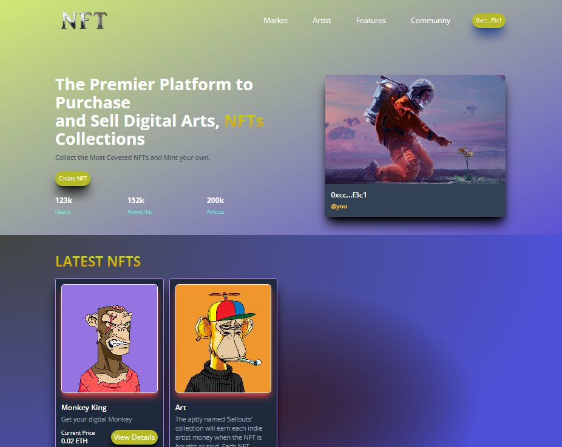

# NFTMarketplace Setup

## This is a NFT Marketplace

Link to live Demo: [**>>NFTMarketplace**](https://group-zee-project.vercel.app/)
: 

   <center><figcaption>NFT page </figcaption></center>

## Technology

This Project uses:

- Metamask
- Vite
- Goerli Faucet
- Infuria
- Truffle
- Solidity
- ReactJs
- Tailwind CSS
- Ganache-CLI
- Web3js

## Running the project

To run the program follow these steps:

1. Clone the project with the code below.

   ```sh

   # Make sure you have the above prerequisites installed already!
   git clone https://github.com/LamsyA/GroupZee-Project
    # Navigate to the new folder.
   npm install # Installs all the dependencies.
   ```

2. Create an Infuria project, copy and paste your key in the spaces below.
3. Update the `.env` file with the following details.
   ```sh
   ENDPOINT_URL=<PROVIDER_URL>
   SECRET_KEY=<SECRET_PHRASE>
   DEPLOYER_KEY=<YOUR_PRIVATE_KEY>
   ```
4. Run the app using `npm run dev`
   <br/>

## Useful links

- 👀 [Web3Js](https://docs.ethers.io/v5/)
- 🎅 [Faucet](https://faucets.chain.link/goerli)
- 🤖 [Ganache](https://trufflesuite.com/ganache/index.html)
- 🤖 [Vite](https://vitejs.dev/guide/)
- ✨ [Live Demo](https://group-zee-project.vercel.app/)
- ⚽ [Metamask](https://metamask.io/)
- 🚀 [Remix Editor](https://remix.ethereum.org/)
- 💡 [Truffle](https://trufflesuite.com/)
- 📈 [Infuria](https://infura.io/)
- 🔥 [ReactJs](https://reactjs.org/)
- 🐻 [Solidity](https://soliditylang.org/)

## Rules of engagement

- Only the minter of an NFT or Artwork can change the price of the art work they minted.
- Others can only purchase the Artwork and take ownership of the Artwork they bought.
